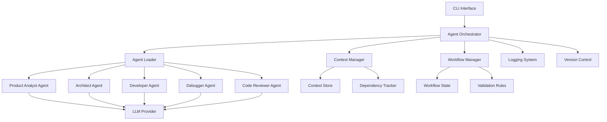

# Design Document

## Overview

The Multi-Agent Development System is a Python-based orchestration framework that coordinates specialized AI agents to perform structured software development. The system uses a modular architecture with clear separation between orchestration, agent execution, context management, and configuration.

The core design philosophy emphasizes:
- **Separation of concerns**: Each agent has a single, well-defined responsibility
- **Explicit state management**: All workflow state is tracked and persisted
- **Configuration over code**: Agent behavior is defined through templates, not hardcoded logic
- **Observability**: Complete visibility into agent decisions and actions

## Architecture

### High-Level Architecture



### Component Architecture

The system is organized into the following layers:

1. **Interface Layer**: CLI and API interfaces for user interaction
2. **Orchestration Layer**: Workflow management and agent coordination
3. **Agent Layer**: Specialized agents with role-specific logic
4. **Infrastructure Layer**: Context management, logging, and persistence
5. **Integration Layer**: LLM providers, version control, file system

## Components and Interfaces

### 1. Agent Orchestrator

**Responsibility**: Coordinates agent execution and workflow progression

**Key Methods**:
```python
class AgentOrchestrator:
    def execute_workflow(self, workflow_config: WorkflowConfig) -> WorkflowResult
    def invoke_agent(self, agent_role: AgentRole, task: Task) -> AgentOutput
    def handle_validation_failure(self, phase: WorkflowPhase, errors: List[ValidationError]) -> None
    def get_workflow_status(self) -> WorkflowStatus
```

**Interactions**:
- Receives workflow requests from CLI
- Loads agent configurations from Agent Loader
- Retrieves context from Context Manager
- Updates workflow state in Workflow Manager
- Logs all activities to Logging System

### 2. Context Manager

**Responsibility**: Maintains shared state and agent outputs

**Key Methods**:
```python
class ContextManager:
    def store_output(self, agent_id: str, output: AgentOutput, metadata: Dict) -> str
    def get_context_for_agent(self, agent_role: AgentRole) -> Context
    def track_dependency(self, source_id: str, target_id: str) -> None
    def get_context_history(self) -> List[ContextEntry]
    def clear_context(self) -> None
```

**Data Structure**:
```python
@dataclass
class ContextEntry:
    id: str
    agent_role: AgentRole
    output: AgentOutput
    metadata: Dict
    timestamp: datetime
    dependencies: List[str]
```

### 3. Workflow Manager

**Responsibility**: Manages workflow state and phase transitions

**Key Methods**:
```python
class WorkflowManager:
    def initialize_workflow(self, config: WorkflowConfig) -> str
    def transition_phase(self, workflow_id: str, next_phase: WorkflowPhase) -> bool
    def validate_phase_completion(self, phase: WorkflowPhase, outputs: List[AgentOutput]) -> ValidationResult
    def rollback_to_phase(self, workflow_id: str, target_phase: WorkflowPhase) -> None
    def get_current_phase(self, workflow_id: str) -> WorkflowPhase
```

**Workflow Phases**:
1. Product Analysis
2. Architecture Design
3. Implementation
4. Debugging
5. Code Review
6. Deployment (future phase)

### 4. Agent Loader

**Responsibility**: Loads and configures agent instances from templates

**Key Methods**:
```python
class AgentLoader:
    def load_agent(self, role: AgentRole) -> Agent
    def reload_configurations(self) -> None
    def validate_template(self, template_path: str) -> ValidationResult
    def get_available_roles(self) -> List[AgentRole]
```

**Template Structure**:
```markdown
# Agent Role: [Role Name]

## Responsibilities
- [Responsibility 1]
- [Responsibility 2]

## Constraints
- [Constraint 1]
- [Constraint 2]

## System Prompt
[Detailed instructions for the agent]

## Input Format
[Expected input structure]

## Output Format
[Expected output structure]

## Validation Rules
- [Rule 1]
- [Rule 2]
```

### 5. Base Agent Class

**Responsibility**: Provides common functionality for all agents

**Key Methods**:
```python
class Agent(ABC):
    def __init__(self, config: AgentConfig, llm_provider: LLMProvider):
        self.config = config
        self.llm = llm_provider
        
    @abstractmethod
    def execute(self, task: Task, context: Context) -> AgentOutput:
        pass
        
    def validate_output(self, output: AgentOutput) -> ValidationResult:
        pass
        
    def format_prompt(self, task: Task, context: Context) -> str:
        pass
```

### 6. Specialized Agents

#### Product Analyst Agent
- Analyzes requirements and user stories
- Identifies technical constraints and dependencies
- Produces structured analysis documents

#### Architect Agent
- Defines system architecture and design patterns
- Validates code against architecture rules
- Maintains design documentation
- Enforces module boundaries

#### Developer Agent
- Generates code based on architecture and requirements
- Implements features incrementally
- Follows coding standards and patterns

#### Debugger Agent
- Analyzes code for errors and issues
- Executes automated tests
- Attempts automatic fixes (up to 3 iterations)
- Documents all issues and resolutions

#### Code Reviewer Agent
- Evaluates code quality metrics
- Identifies code smells and technical debt
- Suggests refactoring opportunities
- Generates review reports

### 7. LLM Provider Interface

**Responsibility**: Abstracts LLM API interactions

**Key Methods**:
```python
class LLMProvider(ABC):
    @abstractmethod
    def generate(self, prompt: str, config: GenerationConfig) -> str:
        pass
        
    @abstractmethod
    def generate_structured(self, prompt: str, schema: Dict) -> Dict:
        pass
```

**Implementations**:
- Claude Provider (primary)
- OpenAI Provider (alternative)
- Local Model Provider (future)

### 8. Logging System

**Responsibility**: Captures all agent activities and decisions

**Key Methods**:
```python
class LoggingSystem:
    def log_agent_activity(self, agent_id: str, activity: Activity, reasoning: str) -> None
    def log_workflow_transition(self, workflow_id: str, from_phase: WorkflowPhase, to_phase: WorkflowPhase) -> None
    def log_decision(self, agent_id: str, decision: Decision, rationale: str) -> None
    def query_logs(self, filters: LogFilters) -> List[LogEntry]
    def generate_summary_report(self, workflow_id: str) -> Report
```

### 9. Version Control Integration

**Responsibility**: Manages git operations for agent outputs

**Key Methods**:
```python
class VersionControlManager:
    def commit_changes(self, agent_role: AgentRole, task_id: str, message: str) -> str
    def create_branch(self, workflow_id: str) -> str
    def handle_conflict(self, conflict: MergeConflict) -> ConflictResolution
    def tag_release(self, workflow_id: str, metadata: Dict) -> None
```

## Data Models

### Core Models

```python
@dataclass
class Task:
    id: str
    description: str
    requirements: List[str]
    context_ids: List[str]
    priority: Priority
    metadata: Dict

@dataclass
class AgentOutput:
    agent_role: AgentRole
    task_id: str
    content: str
    artifacts: List[Artifact]
    validation_status: ValidationStatus
    metadata: Dict

@dataclass
class WorkflowConfig:
    id: str
    phases: List[WorkflowPhase]
    agent_roles: List[AgentRole]
    validation_rules: Dict[WorkflowPhase, List[ValidationRule]]
    context_config: ContextConfig

@dataclass
class ValidationResult:
    is_valid: bool
    errors: List[ValidationError]
    warnings: List[str]
    suggestions: List[str]

@dataclass
class Artifact:
    type: ArtifactType  # CODE, DOCUMENTATION, DIAGRAM, TEST
    path: str
    content: str
    metadata: Dict
```

### Enums

```python
class AgentRole(Enum):
    PRODUCT_ANALYST = "product_analyst"
    ARCHITECT = "architect"
    DEVELOPER = "developer"
    DEBUGGER = "debugger"
    CODE_REVIEWER = "code_reviewer"

class WorkflowPhase(Enum):
    ANALYSIS = "analysis"
    ARCHITECTURE = "architecture"
    IMPLEMENTATION = "implementation"
    DEBUGGING = "debugging"
    REVIEW = "review"
    DEPLOYMENT = "deployment"

class ValidationStatus(Enum):
    PENDING = "pending"
    PASSED = "passed"
    FAILED = "failed"
    NEEDS_REVIEW = "needs_review"
```

## Error Handling

### Error Categories

1. **Configuration Errors**: Invalid templates, missing files
2. **Validation Errors**: Agent output doesn't meet requirements
3. **LLM Errors**: API failures, rate limits, timeouts
4. **Workflow Errors**: Invalid state transitions, missing dependencies
5. **Integration Errors**: Git conflicts, file system issues

### Error Handling Strategy

```python
class ErrorHandler:
    def handle_error(self, error: Exception, context: ErrorContext) -> ErrorResolution:
        if isinstance(error, ConfigurationError):
            return self._handle_configuration_error(error)
        elif isinstance(error, ValidationError):
            return self._handle_validation_error(error, context)
        elif isinstance(error, LLMError):
            return self._handle_llm_error(error)
        elif isinstance(error, WorkflowError):
            return self._handle_workflow_error(error, context)
        else:
            return self._handle_unknown_error(error)
```

**Recovery Strategies**:
- **Retry with backoff**: For transient LLM errors
- **Rollback to previous phase**: For validation failures
- **Manual intervention**: For conflicts and critical errors
- **Graceful degradation**: Continue with warnings when possible

## Testing Strategy

### Unit Tests

- Test each component in isolation
- Mock external dependencies (LLM, file system, git)
- Focus on business logic and state management
- Target: 80%+ code coverage

**Key Test Areas**:
- Agent configuration loading and validation
- Context management and dependency tracking
- Workflow state transitions
- Error handling and recovery

### Integration Tests

- Test component interactions
- Use test doubles for LLM responses
- Verify end-to-end workflows
- Test error propagation

**Test Scenarios**:
- Complete workflow execution (happy path)
- Validation failure and rollback
- Agent coordination and context sharing
- Configuration reload without restart

### End-to-End Tests

- Test full workflows with real LLM calls (optional, gated)
- Verify git integration
- Test CLI interface
- Validate generated artifacts

### Test Data

```python
# Test fixtures for agent outputs
SAMPLE_ANALYSIS_OUTPUT = """
## Product Analysis
- Feature: User Authentication
- Requirements: [...]
"""

SAMPLE_ARCHITECTURE_OUTPUT = """
## Architecture Design
- Pattern: Layered Architecture
- Components: [...]
"""

# Mock LLM responses
MOCK_LLM_RESPONSES = {
    "product_analyst": SAMPLE_ANALYSIS_OUTPUT,
    "architect": SAMPLE_ARCHITECTURE_OUTPUT,
    # ...
}
```

## Configuration Management

### Directory Structure

```
project_root/
├── agents/
│   ├── templates/
│   │   ├── product_analyst.md
│   │   ├── architect.md
│   │   ├── developer.md
│   │   ├── debugger.md
│   │   └── code_reviewer.md
│   └── custom/
│       └── [user-defined templates]
├── workflows/
│   ├── default_workflow.yaml
│   └── custom_workflows/
├── config/
│   ├── system_config.yaml
│   ├── llm_config.yaml
│   └── logging_config.yaml
├── src/
│   ├── orchestration/
│   ├── agents/
│   ├── context/
│   ├── workflow/
│   └── integrations/
└── tests/
```

### Configuration Files

**system_config.yaml**:
```yaml
system:
  agent_templates_dir: "agents/templates"
  custom_templates_dir: "agents/custom"
  context_store_path: ".multi_agent/context"
  log_dir: ".multi_agent/logs"
  
workflow:
  default_workflow: "workflows/default_workflow.yaml"
  max_rollback_attempts: 3
  validation_timeout: 300
  
agents:
  max_retry_attempts: 3
  timeout: 600
```

**llm_config.yaml**:
```yaml
providers:
  claude:
    api_key_env: "ANTHROPIC_API_KEY"
    model: "claude-3-5-sonnet-20241022"
    max_tokens: 4096
    temperature: 0.7
    
  openai:
    api_key_env: "OPENAI_API_KEY"
    model: "gpt-4"
    max_tokens: 4096
    temperature: 0.7

default_provider: "claude"
```

## Performance Considerations

### Optimization Strategies

1. **Parallel Agent Execution**: When agents don't have dependencies, execute in parallel
2. **Context Caching**: Cache frequently accessed context to reduce retrieval time
3. **Incremental Processing**: Process large codebases in chunks
4. **Lazy Loading**: Load agent configurations only when needed

### Resource Management

```python
class ResourceManager:
    def __init__(self, max_concurrent_agents: int = 3):
        self.semaphore = asyncio.Semaphore(max_concurrent_agents)
        
    async def execute_agent(self, agent: Agent, task: Task) -> AgentOutput:
        async with self.semaphore:
            return await agent.execute(task)
```

### Monitoring Metrics

- Agent execution time per phase
- LLM token usage and costs
- Context store size
- Workflow completion rate
- Error frequency by type

## Security Considerations

1. **API Key Management**: Store keys in environment variables, never in code
2. **Input Validation**: Sanitize all user inputs and agent outputs
3. **File System Access**: Restrict agents to designated directories
4. **Code Execution**: Sandbox any code execution by agents
5. **Audit Logging**: Log all agent actions for security review

## Future Enhancements

### Phase 2: MLOps/AIOps Integration

- Model routing and selection
- Cost optimization across LLM providers
- Latency monitoring and optimization
- Automated evaluation and testing
- Self-optimization based on metrics

### Additional Features

- Web-based dashboard for workflow visualization
- Real-time collaboration between human and agents
- Plugin system for custom agents
- Integration with CI/CD pipelines
- Support for multi-repository projects

## Design Decisions and Rationales

### Decision 1: Python as Implementation Language

**Rationale**: 
- Rich ecosystem for AI/ML integrations
- Excellent LLM SDK support
- Strong async capabilities for concurrent agent execution
- Familiar to most developers working with AI

### Decision 2: Markdown for Agent Templates

**Rationale**:
- Human-readable and easy to edit
- Version control friendly
- Supports rich formatting for complex instructions
- No special tooling required

### Decision 3: Sequential Workflow with Rollback

**Rationale**:
- Simpler to reason about than fully parallel workflows
- Easier to debug and trace issues
- Rollback provides safety net for validation failures
- Can optimize with parallel execution within phases later

### Decision 4: Centralized Context Management

**Rationale**:
- Single source of truth for agent outputs
- Easier to track dependencies
- Simplifies debugging and auditing
- Enables context sharing without tight coupling

### Decision 5: LLM Provider Abstraction

**Rationale**:
- Flexibility to switch providers based on cost/performance
- Enables A/B testing of different models
- Future-proofs against provider changes
- Supports local model deployment

## Conclusion

This design provides a solid foundation for a multi-agent development system that is modular, extensible, and maintainable. The architecture emphasizes clear separation of concerns, explicit state management, and comprehensive observability. The system can start with core functionality and incrementally add advanced features like MLOps integration and real-time collaboration.
